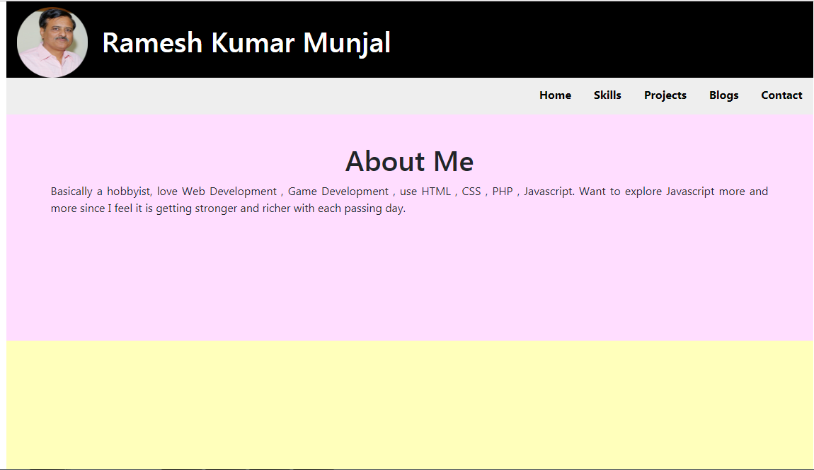

# AssignmentLevel2

Edwisor course Assignment Level 2

## Problem

a. Create all the reponsive design patterns you have learnt using bootstrap.
	You can use colored boxes or any other way to show the differentiation.
b. Create you reponsive portfolio.
c. Create a GIT repository of your portfolio , push your code to that github repository and then make your portfolio live on github pages. You can learn about github pages from this link. 
	Technologies to be used - HTML, CSS, Javascript , Bootstrap
	
## Synopsis

Do take a look at the [Portfolio](https://rameshkmunjal.github.io)

For visualisation we have developed 4 web pages on following responsive design  patterns using bootstrap.

	1. Column Drop
	2. Layout Shifter	
	3. Mostly Fluid
	4. Off Canvas

1. [BookMania.in](Column_Drop/bookmania.html) - This webpage is based on Column Drop design.
	- on large screen page is divided into 3 columns.
	- on medium devices right column drops to bottom and on top screen is occupied by two coltumns . 
	- on small medium , again column drops to bottom and this time it is left side column and bottom space is shared equally by both dropped columns.
	- on extra small screen each of three columns are now sharing full screen space.
	 
2. [DreamCity Developers.com](Layout_Shifter/dreamcity.html) - This webpage is based on Layout Shifter design. 
	- on large screen page is divided into 3 columns.
	- on medium devices right column jumps to top screen, converts into a inline nav bar and occupies full page width while remaining two columns are sharing screen under this nav bar.	   
	- on small medium, overview column drops under image column and all three columns are stacked vertically now.
	- on extra small screen our horizontal nav bar converts into a vertical nav bar.
	 
3. [Pulse Times](Mostly_Fluid/newspaper.html) - This webpage is based on Mostly Fluid design pattern. 
	- on large screen there are two columns above and three columns below.
	- on medium devices there is one column above and  two columns below that and again two columns below . 			   
	- on small medium  and extra small screen , each column is sharing full page width.
4. [Subziwala.com](off-canvas/off-canvas.html) - This webpage is based on off canvas design pattern.
	- on screen sizes upto small media one column is off canvas.
	- on extra small devices all columns are of full width and stacked over one another.	 

	
## Technical Specifications

1. We have used Bootstrap Grid Column system to keep column sizes as per device width.
2. We have used media queries where there is required to make changes in accordance with 
	change in screen width.
3. We have used rem unit of measurement ,  preferably to enhance responsive effects.
4. We have kept image size 100% so that image does not get distorted with the change in screen width.
5. We have divided CSS settings into three groups - 
		Common setting - for elements , classes etc.
		Specific settings - for id of a particular element or element of a particular id.
		Media Query Settings - for changes in accordance with changes in device width.

## Installation

Take a checkout of portfolio and follow the links given above for a demo.

## Contributors

1. Ramesh Kumar Munjal